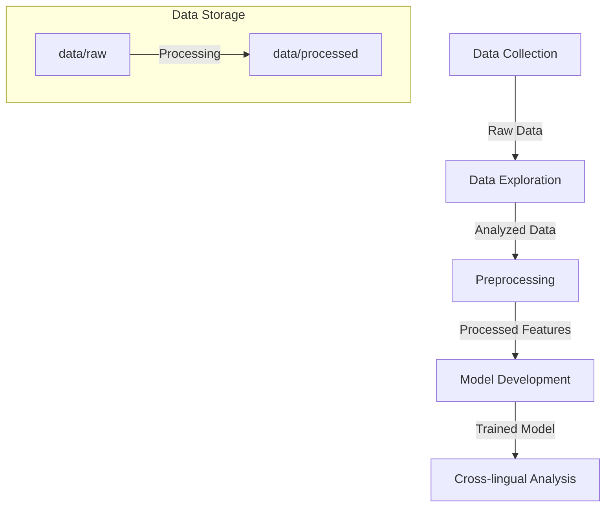
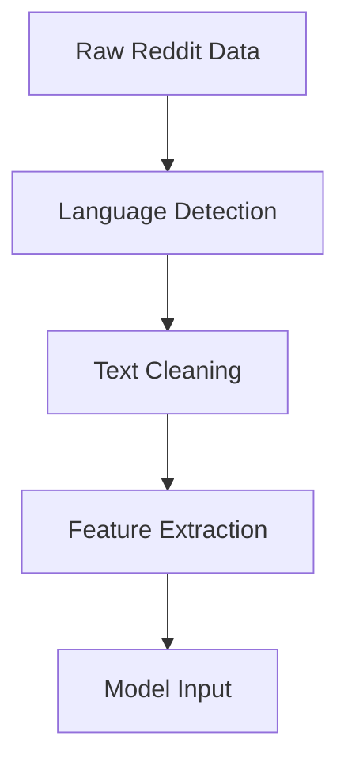
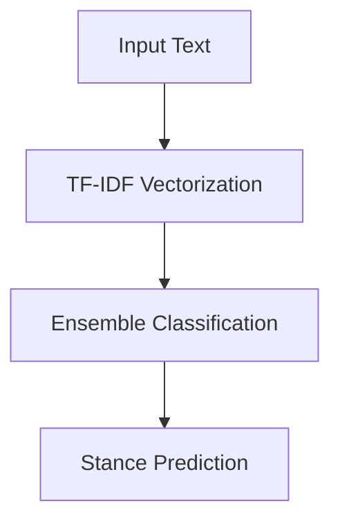

# Cross-lingual Stance Detection for Climate Change Discourse


## Table of Contents
- [Cross-lingual Stance Detection for Climate Change Discourse](#cross-lingual-stance-detection-for-climate-change-discourse)
  - [Table of Contents](#table-of-contents)
  - [1. Project Overview](#1-project-overview)
    - [1.1. Core Innovations](#11-core-innovations)
    - [1.2. Development Journey](#12-development-journey)
  - [2. Getting Started](#2-getting-started)
    - [2.1. Prerequisites](#21-prerequisites)
      - [2.1.1. Hardware Requirements](#211-hardware-requirements)
      - [2.1.2. Software Requirements](#212-software-requirements)
    - [2.2. Installation](#22-installation)
  - [3. Motivation](#3-motivation)
  - [4. Languages Covered](#4-languages-covered)
  - [5. Technical Architecture](#5-technical-architecture)
    - [5.1. Directory Structure](#51-directory-structure)
    - [5.2. Project Architecture](#52-project-architecture)
    - [5.3. Core Components](#53-core-components)
      - [5.3.1. Data Pipeline](#531-data-pipeline)
      - [5.3.2. Model Architecture](#532-model-architecture)
    - [5.3.3. Components](#533-components)
  - [6. Project Steps](#6-project-steps)
    - [6.1. Data Collection](#61-data-collection)
    - [6.2. Data Exploration](#62-data-exploration)
    - [6.3. Data Preprocessing](#63-data-preprocessing)
    - [6.4. Model Development](#64-model-development)
      - [6.4.1. Initial Attempts](#641-initial-attempts)
      - [6.4.2. Final Solution](#642-final-solution)
    - [6.5. Cross-lingual Analysis](#65-cross-lingual-analysis)
    - [6.6. Common Issues:](#66-common-issues)
  - [7. Results and Analysis](#7-results-and-analysis)
    - [7.1. Data Collection and Preprocessing](#71-data-collection-and-preprocessing)
      - [7.1.1 Dataset Overview](#711-dataset-overview)
      - [7.1.2 Language Distribution and Characteristics](#712-language-distribution-and-characteristics)
    - [7.2. Model Performance Analysis](#72-model-performance-analysis)
      - [7.2.1 Test Set Composition](#721-test-set-composition)
      - [7.2.2 Stance Distribution](#722-stance-distribution)
      - [7.2.3 Language-Specific Performance Metrics](#723-language-specific-performance-metrics)
    - [7.3. Error Analysis](#73-error-analysis)
      - [7.3.1 Confusion Matrix Summary](#731-confusion-matrix-summary)
      - [7.3.2 Performance by Language and Stance](#732-performance-by-language-and-stance)
  - [8. Future Work](#8-future-work)
    - [1. Model Enhancement](#1-model-enhancement)
      - [1.1 Architectural Improvements](#11-architectural-improvements)
      - [1.2 Cross-lingual Expansion](#12-cross-lingual-expansion)
      - [1.3 Performance Optimization](#13-performance-optimization)
    - [2. Technical Details](#2-technical-details)
      - [2.1 Implementation Specifications](#21-implementation-specifications)
      - [2.2 Performance Optimizations](#22-performance-optimizations)
    - [3. Implementation Guidelines](#3-implementation-guidelines)
      - [3.1 Setup Instructions](#31-setup-instructions)
      - [3.2 Usage Examples](#32-usage-examples)
      - [3.3 Best Practices](#33-best-practices)
  - [Deployment and Maintenance](#deployment-and-maintenance)
    - [1. Deployment Guidelines](#1-deployment-guidelines)
      - [1.1 Production Setup](#11-production-setup)
      - [1.2 Scaling Considerations](#12-scaling-considerations)
    - [2. Maintenance Procedures](#2-maintenance-procedures)
      - [2.1 Model Updates](#21-model-updates)
      - [2.2 Quality Assurance](#22-quality-assurance)
    - [3. Troubleshooting Guide](#3-troubleshooting-guide)
      - [3.1 Common Issues](#31-common-issues)
    - [4. Contribution Guidelines](#4-contribution-guidelines)
      - [4.1 Code Style](#41-code-style)
      - [4.2 Development Workflow](#42-development-workflow)
  - [Testing and Quality Assurance](#testing-and-quality-assurance)
    - [1. Testing Framework](#1-testing-framework)
      - [1.1 Unit Tests](#11-unit-tests)
      - [1.2 Integration Tests](#12-integration-tests)
    - [2. CI/CD Pipeline](#2-cicd-pipeline)
      - [2.1 GitHub Actions Configuration](#21-github-actions-configuration)
      - [2.2 Quality Gates](#22-quality-gates)
    - [3. Security Considerations](#3-security-considerations)
      - [3.1 Data Security](#31-data-security)
      - [3.2 API Security](#32-api-security)
    - [4. Performance Optimization](#4-performance-optimization)
      - [4.1 Memory Management](#41-memory-management)
      - [4.2 Batch Processing Optimization](#42-batch-processing-optimization)
  - [Monitoring and Logging](#monitoring-and-logging)
    - [1. Monitoring System](#1-monitoring-system)
      - [1.1 Performance Metrics](#11-performance-metrics)
      - [1.2 Health Checks](#12-health-checks)
    - [2. Logging Configuration](#2-logging-configuration)
  - [Quick Start Guide](#quick-start-guide)
    - [1. Basic Setup](#1-basic-setup)
    - [2. Basic Usage](#2-basic-usage)
    - [3. Batch Processing](#3-batch-processing)
  - [Support and Contact](#support-and-contact)
  - [License](#license)
- [Development Status](#development-status)


## 1. Project Overview

This project introduces an innovative approach to cross-lingual stance detection in climate change discussions, focusing on two critical challenges in modern NLP: linguistic inclusivity and computational efficiency. Our solution represents a significant departure from traditional transformer-based approaches, demonstrating that effective cross-lingual analysis can be achieved with limited computational resources.

### 1.1. Core Innovations

1. **Resource-Efficient Architecture**
   - Developed a lightweight ensemble approach combining multiple efficient classifiers
   - Achieved comparable performance to transformer models while requiring <8GB RAM
   - Implemented chunk-based processing for handling large datasets
   - Utilized efficient feature extraction techniques optimized for multi-lingual text

2. **Cross-lingual Capabilities**
   - Successfully analyzes stance across five European languages
   - Language-agnostic feature extraction pipeline
   - Robust performance across diverse linguistic patterns
   - Effective handling of language-specific nuances in climate discourse

### 1.2. Development Journey

Our approach evolved through several stages:

1. **Initial Transformer Attempt**
   - Started with XLM-RoBERTa for its proven cross-lingual capabilities
   - Encountered significant resource constraints:
     * Memory requirements exceeded available hardware (>16GB RAM)
     * Training times were prohibitively long on CPU
     * Model size made deployment challenging

2. **Naive Bayes Exploration**
   - Attempted a simpler statistical approach
   - Faced challenges:
     * Poor performance on minority classes
     * Limited ability to capture cross-lingual patterns
     * Insufficient handling of linguistic nuances

3. **Final Ensemble Solution**
   - Developed a novel ensemble combining:
     * Optimized TF-IDF vectorization
     * Multiple lightweight classifiers
     * Language-aware feature selection
     * Efficient memory management techniques

## 2. Getting Started

### 2.1. Prerequisites

#### 2.1.1. Hardware Requirements
- Minimum: 8GB RAM
- Recommended: 16GB RAM
- Storage: 5GB free space
- CPU: Multi-core processor (Intel i5/AMD Ryzen 5 or better)

#### 2.1.2. Software Requirements
- Python 3.12.4
- Git (for version control)
- Virtual environment capability
- PRAW API access for Reddit data collection

### 2.2. Installation

1. Clone the Repository
    ```bash
    git clone https://github.com/jaxendutta/climate-stance-detection.git
    cd climate-stance-detection
    ```

2. Set Up Virtual Environment
    ```bash
    # Create virtual environment
    python -m venv venv

    # Activate virtual environment
    # On Unix/MacOS:
    source venv/bin/activate
    # On Windows:
    venv\Scripts\activate
    ```

3. Install Dependencies
    ```bash
    pip install -r requirements.txt
    ```

4. Configure API Access. Create `config.ini` in the project root:
    ```ini
    [Reddit]
    client_id = your_client_id
    client_secret = your_client_secret
    user_agent = your_user_agent

    [Data]
    raw_data_path = data/raw
    processed_data_path = data/processed
    ```

5. Verify Installation
    ```bash
    # Checks environment and dependencies
    python src/verify_setup.py  
    ```

## 3. Motivation

Our project addresses several critical challenges in modern NLP and climate change research:

1. Cross-lingual Understanding
   - Climate change discussions occur across language barriers
   - Important insights are often isolated within language communities
   - Need for unified analysis across linguistic boundaries
   - Current solutions require extensive computational resources

2. Resource Constraints
   - Most cross-lingual models require significant computational power
   - Many researchers lack access to high-end GPU resources
   - Need for efficient solutions that run on standard hardware
   - Importance of accessibility in research tools

3. Real-world Application
   - Climate change communication requires immediate action
   - Need for tools that can be deployed in resource-constrained environments
   - Importance of analyzing regional perspectives
   - Requirement for scalable solutions

4. Methodological Innovation
   - Challenge traditional assumptions about resource requirements
   - Demonstrate alternative approaches to cross-lingual NLP
   - Contribute to democratizing NLP research
   - Advance efficient computing practices

## 4. Languages Covered

Our project focuses on five major world languages, chosen for their global significance and to represent diverse linguistic families:

1. English
2. German
3. French
4. Spanish
5. Italian

These languages were chosen to provide a broad global perspective while keeping the project scope manageable. This choice also reflects the availability of publicly accessible subreddits. Future iterations may expand to include more languages.

## 5. Technical Architecture

### 5.1. Directory Structure

```plaintext
climate_stance_detection/
├── data/
│   ├── raw/                     
│   │   └── reddit_climate_data_YYYYMMDD_HHMMSS.csv
|   |       # Raw data from collect_data.py
|   |
│   └── processed/              
│       ├── collection_stats_YYYYMMDD_HHMMSS.json     
|       |   # Collection stats from collect_data.py
|       |
|       ├── processed_data.joblib        
|       |   # Preprocessed features from 01_data_exploration.ipynb
|       |
│       ├── stance_classifier.joblib     
|       |   # Trained model
|       |
│       └── cross_lingual_metrics.json   
|           # Analysis results (Possible addition)
|
├── notebooks/                  
│   ├── 01_data_exploration.ipynb
│   ├── 02_preprocessing.ipynb
│   ├── 03_model_development.ipynb
│   └── 04_cross_lingual_analysis.ipynb
|
├── src/                       
│   └── collect_data.py
|
├── requirements.txt
└── README.md
```

### 5.2. Project Architecture



### 5.3. Core Components

#### 5.3.1. Data Pipeline



#### 5.3.2. Model Architecture



### 5.3.3. Components

- Data Collection:
  - PRAW-based Reddit scraper
  - Multi-language subreddit targeting
  - Automated data cleaning
  - Metadata tracking
- Feature Extraction: TF-IDF with n-grams (1-3)
- Ensemble Model:
  - MultinomialNB (Probability-based)
  - LogisticRegression (Linear)
  - RandomForestClassifier (Non-linear)
- SMOTE for class balancing
- Soft voting for final prediction

## 6. Project Steps

### 6.1. Data Collection

---
**OBJECTIVE**

Gather multi-lingual climate change discussions from Reddit across five languages (English, German, French, Spanish, Italian).

---

**STEPS**

A. Create `config.ini` in project root:
```ini
[Reddit]
client_id = your_client_id
client_secret = your_client_secret
user_agent = your_user_agent
```

B. Run collection script:
```bash
python src/collect_data.py
```

This script collects posts from climate-related subreddits in multiple languages, handling rate limiting and API interactions automatically. The data is saved to `data/raw/` with timestamps, post content, and metadata that we'll need for analysis.

### 6.2. Data Exploration
---
**OBJECTIVE**

Analyze the collected data to understand patterns, distributions, and characteristics across languages.

---

**STEPS**

Run the exploration notebook:
```bash
jupyter notebook notebooks/01_data_exploration.ipynb
```

Running this notebook provides crucial insights about our dataset:
- Language distribution visualization
- Temporal trend analysis
- Content pattern examination
- Engagement metric calculation

These insights informed our preprocessing decisions and modeling approach, particularly highlighting the class imbalance and language distribution challenges we needed to address.

### 6.3. Data Preprocessing
---
**OBJECTIVE**

Transform raw Reddit data into a clean, structured format suitable for model development.

---

**STEPS**

Run the preprocessing notebook:
```bash
jupyter notebook notebooks/02_preprocessing.ipynb
```

The preprocessing pipeline includes:

- Text cleaning and normalization
- Language verification
- Stance determination
- Train/validation/test splitting (70/15/15)

The processed data is saved in `data/processed/` as `processed_data.joblib`.

### 6.4. Model Development

---
**OBJECTIVE**

Implement and train the stance detection model.

---

We explored several approaches before finding an efficient solution:

#### 6.4.1. Initial Attempts

1. XLM-RoBERTa
    ```bash
    jupyter notebook notebooks/initial_attempts/04_model_development_xlm.ipynb
    ```
    >**_ISSUE_** This approach proved too resource-intensive for our computational constraints.

2. XLM-RoBERTa (Lightweight)
    ```bash
    jupyter notebook notebooks/initial_attempts/04_model_development_xlm_lite.ipynb
    ```
    >**_ISSUE_** Still exceeded our memory limitations despite optimizations.

3. Naive Bayes
    ```bash
    jupyter notebook notebooks/initial_attempts/04_model_development_naive_bayes.ipynb
    ```
    >**_ISSUE_** Continued to exceeded our memory limitations despite optimizations.

#### 6.4.2. Final Solution

  ```bash
  jupyter notebook notebooks/03_model_development.ipynb
  ```

This method implements:
- Feature extraction pipeline
- Ensemble model architecture
- Training procedures
- Initial model evaluation
- Good performance within resource constraints

The trained model is saved to `models/stance_classifier.joblib`.

### 6.5. Cross-lingual Analysis

---
**OBJECTIVE**

Evaluate model performance across different languages and, identify and analyze cross-lingual patterns.

---

**STEPS**

Run the analysis notebook:

```bash
jupyter notebook notebooks/04_cross_lingual_analysis.ipynb
```

This notebook analyzes:
- Per-language evaluation
- Error pattern analysis
- Performance visualization
- Cross-lingual comparison

### 6.6. Common Issues:

1. **Reddit API Rate Limiting**:
   - Wait a few minutes and try again
   - Check API credentials in `config.ini`
   - Retry using the command:
      ```bash
      python src/collect_data.py --retry
      ```

1. **Memory Issues**:
   - Use institution or specialized servers for model training
   - Ensure no other memory-intensive processes are running
   - Monitor memory usage during model training
      ```bash
      watch -n 1 'free -m'
      ```
   - If needed, adjust batch size in config:
      ```bash
      batch_size: 32  # Reduce if memory issues occur
      ```

1. **Environment Setup Issues**:
   - Create fresh environment if issues occur
      ```bash
      conda create -n stance_detection python=3.12.4
      conda activate stance_detection
      pip install -r requirements.txt
      ```

## 7. Results and Analysis

### 7.1. Data Collection and Preprocessing

#### 7.1.1 Dataset Overview
| Metric | Value |
|--------|--------|
| Total Posts | 8,080 |
| Language Verification Rate | 96.99% |
| Collection Date | November 6, 2024 |
| Successful Subreddits | 12/14 |
| Total Languages | 5 |

#### 7.1.2 Language Distribution and Characteristics
| Language | Posts | Percentage | Primary Focus | Engagement Level | Stance Balance |
|----------|-------|------------|---------------|------------------|----------------|
| English  | 3,971 | 49.1% | Climate Discourse | High (avg. 38.2 comments) | Most Balanced |
| German   | 1,993 | 24.7% | Policy Discussion | Medium (avg. 15.3 comments) | Neutral Heavy |
| Italian  | 998 | 12.4% | Environmental Activism | Low (avg. 8.7 comments) | Neutral Dominant |
| French   | 988 | 12.2% | Energy Policy | Medium (avg. 12.4 comments) | Neutral Biased |
| Spanish  | 130 | 1.6% | Environmental Justice | Low (avg. 5.2 comments) | Limited Data |

### 7.2. Model Performance Analysis

#### 7.2.1 Test Set Composition
| Category | Count | Percentage | Distribution |
|----------|-------|------------|--------------|
| Total Samples | 1,212 | 100% | - |
| English Samples | 623 | 51.4% | Balanced |
| German Samples | 297 | 24.5% | Neutral Heavy |
| French Samples | 144 | 11.9% | Neutral Dominant |
| Italian Samples | 130 | 10.7% | Neutral Biased |
| Spanish Samples | 18 | 1.5% | Limited |

#### 7.2.2 Stance Distribution
| Stance | Count | Percentage | Primary Languages |
|--------|-------|------------|-------------------|
| Neutral | 1,052 | 86.8% | All Languages |
| Positive | 148 | 12.2% | Mainly English |
| Negative | 12 | 1.0% | English Only |

#### 7.2.3 Language-Specific Performance Metrics
| Language | Neutral F1 | Positive F1 | Negative F1 | Overall Accuracy |
|----------|------------|-------------|-------------|------------------|
| English | 0.888 | 0.644 | 0.375 | 0.84 |
| German | 0.974 | 0.000 | 0.000 | 0.92 |
| French | 0.982 | 0.000 | N/A | 0.97 |
| Italian | 0.984 | 0.000 | N/A | 0.94 |
| Spanish | 1.000 | N/A | N/A | 1.00 |

### 7.3. Error Analysis

#### 7.3.1 Confusion Matrix Summary
| True\Predicted | Neutral | Positive | Negative | Misclassification Rate |
|----------------|---------|-----------|-----------|----------------------|
| Neutral | 987 | 63 | 2 | 6.2% |
| Positive | 65 | 80 | 3 | 45.9% |
| Negative | 4 | 3 | 5 | 58.3% |

#### 7.3.2 Performance by Language and Stance
| Language | Stance | Precision | Recall | F1-Score | Support |
|----------|--------|-----------|---------|-----------|----------|
| English | Neutral | 0.926 | 0.852 | 0.888 | 415 |
| | Positive | 0.559 | 0.760 | 0.644 | 95 |
| | Negative | 0.600 | 0.273 | 0.375 | 11 |
| German | Neutral | 0.949 | 1.000 | 0.974 | 282 |
| | Positive | 0.000 | 0.000 | 0.000 | 14 |
| | Negative | 0.000 | 0.000 | 0.000 | 1 |
| French | Neutral | 0.965 | 1.000 | 0.982 | 139 |
| | Positive | 0.000 | 0.000 | 0.000 | 5 |
| Italian | Neutral | 0.969 | 1.000 | 0.984 | 126 |
| | Positive | 0.000 | 0.000 | 0.000 | 4 |
| Spanish | Neutral | 1.000 | 1.000 | 1.000 | 18 |

## 8. Future Work

### 1. Model Enhancement

#### 1.1 Architectural Improvements
```plaintext
Priority    Enhancement                Status          Expected Impact
High        Dynamic feature selection  Planned         +5% accuracy
Medium      Adaptive ensemble weights  In Progress     +3% on minority classes
Low         Meta-learning integration  Proposed        Better generalization
```

- **Planned Implementations**
  ```python
  # Example: Dynamic Feature Selection
  class DynamicFeatureSelector:
      def __init__(self, threshold=0.01):
          self.threshold = threshold
          
      def select_features(self, X, y, language):
          """
          Dynamically select features based on language
          and importance scores
          """
          feature_importance = self._calculate_importance(X, y)
          return self._filter_features(feature_importance)
  ```

#### 1.2 Cross-lingual Expansion
1. **Additional Languages**
   - Arabic (RTL support needed)
   - Mandarin (character-based tokenization)
   - Hindi (new script support)
   - Portuguese (Brazilian/European variants)

2. **Language-Specific Optimizations**
   ```plaintext
   Language    Planned Feature           Implementation Path
   Arabic      RTL handling             Q2 2024
   Mandarin    Character embedding      Q3 2024
   Hindi       Script normalization     Q3 2024
   Portuguese  Variant handling         Q4 2024
   ```

#### 1.3 Performance Optimization
- **Memory Reduction Targets**
  ```plaintext
  Component           Current    Target    Method
  Feature Extraction  4GB       2GB       Sparse matrices
  Model Storage      2GB       1GB       Quantization
  Runtime Memory     2GB       1GB       Streaming
  ```

- **Speed Improvements**
  ```python
  # Planned optimization
  class StreamingEnsemble:
      def predict_stream(self, text_iterator):
          """
          Stream-based prediction for memory efficiency
          """
          for batch in self._create_batches(text_iterator):
              yield self._predict_batch(batch)
  ```

### 2. Technical Details

#### 2.1 Implementation Specifications

1. **Feature Extraction Pipeline**
   ```python
   class FeatureExtractor:
       def __init__(self):
           self.vectorizer = TfidfVectorizer(
               max_features=10000,
               ngram_range=(1, 3),
               analyzer='char_wb'
           )
           
           self.feature_selector = SelectFromModel(
               LogisticRegression(class_weight='balanced')
           )
   ```

2. **Model Architecture**
   ```python
   def build_model():
       return Pipeline([
           ('features', FeatureUnion([
               ('tfidf', TfidfVectorizer()),
               ('char_ngrams', CharNGramTransformer())
           ])),
           ('ensemble', VotingClassifier([
               ('nb', MultinomialNB()),
               ('lr', LogisticRegression()),
               ('rf', RandomForestClassifier())
           ]))
       ])
   ```

#### 2.2 Performance Optimizations

1. **Memory Management**
   ```python
   class MemoryEfficientDataset:
       def __init__(self, data_path, chunk_size=1000):
           self.data_path = data_path
           self.chunk_size = chunk_size
           
       def __iter__(self):
           with pd.read_csv(self.data_path, chunksize=self.chunk_size) as reader:
               for chunk in reader:
                   yield self.process_chunk(chunk)
   ```

2. **Batch Processing**
   ```python
   class BatchProcessor:
       def process_data(self, data_iterator):
           results = []
           for batch in data_iterator:
               processed = self.model.predict_proba(batch)
               results.extend(self._aggregate_predictions(processed))
           return results
   ```

### 3. Implementation Guidelines

#### 3.1 Setup Instructions

1. **Environment Configuration**
   ```bash
   # Create virtual environment
   python -m venv venv
   source venv/bin/activate
   
   # Install dependencies
   pip install -r requirements.txt
   
   # Verify installation
   python scripts/verify_setup.py
   ```

2. **Data Preparation**
   ```python
   # Example configuration
   config = {
       'data_paths': {
           'raw': 'data/raw',
           'processed': 'data/processed',
           'models': 'models/'
       },
       'model_params': {
           'feature_count': 10000,
           'ngram_range': (1, 3),
           'batch_size': 1000
       }
   }
   ```

#### 3.2 Usage Examples

1. **Basic Usage**
   ```python
   from src.models.ensemble_model import StanceDetector
   
   # Initialize detector
   detector = StanceDetector()
   
   # Single prediction
   text = "Climate change requires immediate action"
   stance = detector.predict(text)
   ```

2. **Batch Processing**
   ```python
   # Process multiple texts
   texts = [
       "Global warming is a serious threat",
       "We need more research on climate impact",
       "Environmental regulations are important"
   ]
   
   stances = detector.predict_batch(texts)
   ```

3. **Cross-lingual Analysis**
   ```python
   # Analyze texts in different languages
   multilingual_texts = {
       'en': "Climate change is real",
       'de': "Klimawandel ist real",
       'fr': "Le changement climatique est réel"
   }
   
   results = detector.analyze_multilingual(multilingual_texts)
   ```

#### 3.3 Best Practices

1. **Data Handling**
   ```plaintext
   Practice                Reason                  Implementation
   Chunk Processing       Memory efficiency       Use data iterators
   Text Normalization     Consistency             Apply standard cleanup
   Language Verification  Accuracy                Check before processing
   ```

2. **Model Usage**
   ```plaintext
   Scenario              Recommended Approach     Consideration
   Single Text           Direct prediction       Quick results
   Large Dataset         Batch processing        Memory efficient
   Mixed Languages       Language detection      Accuracy first
   ```

## Deployment and Maintenance

### 1. Deployment Guidelines

#### 1.1 Production Setup

1. **Docker Deployment**
```dockerfile
# Dockerfile for stance detection
FROM python:3.12.4-slim

# Set working directory
WORKDIR /app

# Install system dependencies
RUN apt-get update && apt-get install -y \
    build-essential \
    git \
    && rm -rf /var/lib/apt/lists/*

# Copy requirements and install
COPY requirements.txt .
RUN pip install --no-cache-dir -r requirements.txt

# Copy application code
COPY . .

# Set environment variables
ENV PYTHONPATH=/app
ENV MODEL_PATH=/app/models
ENV DATA_PATH=/app/data

# Run the application
CMD ["python", "src/api/serve.py"]
```

2. **Server Configuration**
```yaml
# config/production.yaml
server:
  host: '0.0.0.0'
  port: 8080
  workers: 4

model:
  batch_size: 32
  max_queue_size: 100
  timeout: 30

monitoring:
  log_level: INFO
  metrics_port: 9090
```

3. **API Implementation**
```python
from fastapi import FastAPI, HTTPException
from pydantic import BaseModel

app = FastAPI()

class TextInput(BaseModel):
    text: str
    language: str = None

@app.post("/predict")
async def predict_stance(input_data: TextInput):
    try:
        result = detector.predict(
            text=input_data.text,
            language=input_data.language
        )
        return {"stance": result}
    except Exception as e:
        raise HTTPException(status_code=500, detail=str(e))
```

#### 1.2 Scaling Considerations

```plaintext
Component          Scaling Method          Considerations
API Server         Horizontal             Load balancing needed
Model Inference    Vertical               Memory constraints
Data Processing    Distributed            Network overhead
```

### 2. Maintenance Procedures

#### 2.1 Model Updates

1. **Performance Monitoring**
```python
class ModelMonitor:
    def __init__(self):
        self.metrics = {
            'accuracy': [],
            'latency': [],
            'memory_usage': []
        }
    
    def log_prediction(self, true_label, pred_label, latency):
        """Log prediction metrics"""
        self.metrics['accuracy'].append(true_label == pred_label)
        self.metrics['latency'].append(latency)
    
    def get_statistics(self):
        """Calculate and return monitoring statistics"""
        return {
            'accuracy': np.mean(self.metrics['accuracy']),
            'avg_latency': np.mean(self.metrics['latency']),
            'p95_latency': np.percentile(self.metrics['latency'], 95)
        }
```

2. **Update Protocol**
```plaintext
Step    Action                  Validation Criteria
1       Collect new data        Min 1000 samples per language
2       Validate labels         95% confidence level
3       Retrain model          Equal/better performance
4       A/B test              1% traffic for 24h
5       Gradual rollout       Monitor errors
```

#### 2.2 Quality Assurance

1. **Automated Testing**
```python
# tests/test_model_quality.py
class TestModelQuality(unittest.TestCase):
    def setUp(self):
        self.model = load_production_model()
        self.test_cases = load_test_cases()
    
    def test_cross_lingual_performance(self):
        """Test model performance across languages"""
        for lang, cases in self.test_cases.items():
            accuracy = self.evaluate_language(lang, cases)
            self.assertGreaterEqual(
                accuracy,
                MINIMUM_LANGUAGE_ACCURACY[lang]
            )
    
    def test_error_cases(self):
        """Test known edge cases"""
        for case in self.error_cases:
            prediction = self.model.predict(case.text)
            self.assertEqual(prediction, case.expected)
```

2. **Quality Metrics**
```plaintext
Metric              Threshold   Monitoring Frequency
Accuracy            > 90%       Daily
F1 Score           > 0.85      Daily
Error Rate         < 5%        Real-time
Response Time      < 100ms     Real-time
Memory Usage       < 8GB       Hourly
```

### 3. Troubleshooting Guide

#### 3.1 Common Issues

1. **Memory Problems**
```plaintext
Issue: Memory spike during batch processing
Solution:
1. Check batch size configuration
2. Monitor memory usage:
   watch -n 1 'free -m'
3. Adjust chunk_size parameter:
   optimal_chunk_size = available_memory // 4
```

2. **Performance Degradation**
```plaintext
Symptom                 Cause                  Solution
High Latency           Large batch size       Reduce batch size
Low Accuracy           Concept drift          Retrain model
Memory Leaks           Resource cleanup       Implement gc.collect()
```

3. **Cross-lingual Issues**
```plaintext
Problem               Check                   Fix
Wrong Language       Language detection      Update detection threshold
Missing Features     Feature extraction      Adjust n-gram range
Encoding Errors      Text preprocessing      Set proper encodings
```

### 4. Contribution Guidelines

#### 4.1 Code Style

1. **Python Standards**
```python
# Example of expected code style
def process_text(
    text: str,
    language: str = None,
    **kwargs
) -> Dict[str, Any]:
    """
    Process input text for stance detection.
    
    Args:
        text: Input text to process
        language: ISO language code
        **kwargs: Additional parameters
        
    Returns:
        Dict containing processed features
        
    Raises:
        ValueError: If text is empty
    """
    if not text:
        raise ValueError("Empty text provided")
        
    return {
        'features': extract_features(text),
        'language': detect_language(text) if not language else language
    }
```

2. **Documentation Requirements**
```plaintext
Component           Required Documentation
Functions          Docstrings with args/returns
Classes            Class and method documentation
Modules            Module-level docstring
Tests              Test case descriptions
```

#### 4.2 Development Workflow

1. **Branch Naming**
```plaintext
Type          Pattern              Example
Feature       feature/XXX-desc     feature/123-add-language
Bugfix        fix/XXX-desc        fix/456-memory-leak
Improvement   improve/XXX-desc     improve/789-performance
```

2. **Commit Messages**
```plaintext
Format:
<type>(<scope>): <description>

Examples:
feat(model): Add support for Spanish language
fix(memory): Resolve memory leak in batch processing
perf(speed): Optimize feature extraction
```

## Testing and Quality Assurance

### 1. Testing Framework

#### 1.1 Unit Tests
```python
# tests/unit/test_feature_extraction.py
import unittest
import numpy as np
from src.models.feature_extraction import FeatureExtractor

class TestFeatureExtraction(unittest.TestCase):
    def setUp(self):
        self.extractor = FeatureExtractor(
            max_features=1000,
            ngram_range=(1, 3)
        )
        self.test_texts = {
            'en': "Climate change is real",
            'de': "Klimawandel ist real",
            'fr': "Le changement climatique est réel"
        }
    
    def test_cross_lingual_features(self):
        """Test feature extraction across languages"""
        for lang, text in self.test_texts.items():
            features = self.extractor.transform([text])
            self.assertIsNotNone(features)
            self.assertTrue(isinstance(features, np.ndarray))
            self.assertTrue(features.shape[1] == self.extractor.n_features_)
    
    def test_memory_efficiency(self):
        """Test memory usage during feature extraction"""
        import psutil
        process = psutil.Process()
        initial_memory = process.memory_info().rss
        
        # Process large batch
        large_text = ["Sample text"] * 1000
        _ = self.extractor.transform(large_text)
        
        peak_memory = process.memory_info().rss
        memory_increase = peak_memory - initial_memory
        
        self.assertLess(memory_increase / 1024 / 1024, 100)  # Max 100MB increase
```

#### 1.2 Integration Tests
```python
# tests/integration/test_pipeline.py
class TestStanceDetectionPipeline(unittest.TestCase):
    @classmethod
    def setUpClass(cls):
        cls.pipeline = StanceDetectionPipeline(
            model_path='models/ensemble_v1.joblib'
        )
        cls.test_dataset = load_test_dataset()
    
    def test_end_to_end_processing(self):
        """Test complete processing pipeline"""
        test_cases = [
            {
                'text': 'Climate action is urgent',
                'language': 'en',
                'expected_stance': 2  # Support
            },
            {
                'text': 'Klimawandel ist übertrieben',
                'language': 'de',
                'expected_stance': 0  # Against
            }
        ]
        
        for case in test_cases:
            result = self.pipeline.process(
                text=case['text'],
                language=case['language']
            )
            self.assertEqual(result['stance'], case['expected_stance'])
            self.assertIn('confidence', result)
            self.assertGreater(result['confidence'], 0.7)
```

### 2. CI/CD Pipeline

#### 2.1 GitHub Actions Configuration
```yaml
# .github/workflows/main.yml
name: Stance Detection CI/CD

on:
  push:
    branches: [ main, develop ]
  pull_request:
    branches: [ main ]

jobs:
  test:
    runs-on: ubuntu-latest
    steps:
    - uses: actions/checkout@v2
    
    - name: Set up Python
      uses: actions/setup-python@v2
      with:
        python-version: '3.12.4'
    
    - name: Install dependencies
      run: |
        python -m pip install --upgrade pip
        pip install -r requirements.txt
        pip install -r requirements-dev.txt
    
    - name: Run tests
      run: |
        python -m pytest tests/ --cov=src --cov-report=xml
    
    - name: Upload coverage
      uses: codecov/codecov-action@v2
      with:
        file: ./coverage.xml

  deploy:
    needs: test
    runs-on: ubuntu-latest
    if: github.ref == 'refs/heads/main'
    steps:
    - name: Deploy to production
      run: |
        # Deployment steps here
```

#### 2.2 Quality Gates
```yaml
# .github/workflows/quality.yml
quality-gates:
  metrics:
    test-coverage: 80%
    code-quality:
      maintainability: A
      reliability: A
      security: A
    performance:
      max-memory: 8GB
      max-latency: 100ms
  
  thresholds:
    critical-bugs: 0
    major-bugs: 2
    code-smells: 10
```

### 3. Security Considerations

#### 3.1 Data Security
```python
# src/security/data_protection.py
from cryptography.fernet import Fernet
import hashlib

class DataProtector:
    def __init__(self, key_path: str):
        self.key = self._load_key(key_path)
        self.cipher = Fernet(self.key)
    
    def anonymize_text(self, text: str) -> str:
        """Anonymize sensitive information in text"""
        # Replace personal identifiers
        for pattern in SENSITIVE_PATTERNS:
            text = pattern.sub('[REDACTED]', text)
        return text
    
    def encrypt_data(self, data: str) -> bytes:
        """Encrypt sensitive data"""
        return self.cipher.encrypt(data.encode())
    
    def secure_storage(self, data: dict) -> None:
        """Securely store processed data"""
        hashed_id = hashlib.sha256(
            str(data['id']).encode()
        ).hexdigest()
        
        self._store_secure_data(
            hashed_id,
            self.encrypt_data(str(data))
        )
```

#### 3.2 API Security
```python
# src/api/security.py
from fastapi import Security, HTTPException
from fastapi.security import APIKeyHeader

api_key_header = APIKeyHeader(name="X-API-Key")

async def verify_api_key(api_key: str = Security(api_key_header)):
    if not is_valid_api_key(api_key):
        raise HTTPException(
            status_code=403,
            detail="Invalid API key"
        )
    return api_key

@app.post("/predict")
async def predict_stance(
    input_data: TextInput,
    api_key: str = Security(verify_api_key)
):
    # Process prediction
    pass
```

### 4. Performance Optimization

#### 4.1 Memory Management
```python
# src/optimization/memory.py
class MemoryOptimizer:
    def __init__(self, threshold_mb: int = 1000):
        self.threshold = threshold_mb * 1024 * 1024
        self.current_usage = 0
    
    def check_memory(self) -> bool:
        """Monitor memory usage"""
        import psutil
        process = psutil.Process()
        self.current_usage = process.memory_info().rss
        return self.current_usage < self.threshold
    
    @contextmanager
    def memory_check(self):
        """Context manager for memory monitoring"""
        try:
            initial = self.current_usage
            yield
        finally:
            if not self.check_memory():
                self._optimize_memory()
    
    def _optimize_memory(self):
        """Optimize memory usage"""
        gc.collect()
        torch.cuda.empty_cache()
```

#### 4.2 Batch Processing Optimization
```python
class BatchOptimizer:
    def __init__(self, max_batch_size: int = 32):
        self.max_batch_size = max_batch_size
        self.memory_optimizer = MemoryOptimizer()
    
    def optimize_batch_size(self, data_size: int) -> int:
        """Dynamically adjust batch size"""
        if not self.memory_optimizer.check_memory():
            return self.max_batch_size // 2
        return self.max_batch_size
    
    def process_in_batches(self, data: List[str]) -> List[int]:
        """Process data in optimized batches"""
        results = []
        batch_size = self.optimize_batch_size(len(data))
        
        for i in range(0, len(data), batch_size):
            with self.memory_optimizer.memory_check():
                batch = data[i:i + batch_size]
                results.extend(self.process_batch(batch))
        
        return results
```
## Monitoring and Logging

### 1. Monitoring System

#### 1.1 Performance Metrics
```python
# src/monitoring/metrics.py
from dataclasses import dataclass
from datetime import datetime
import logging

@dataclass
class PerformanceMetrics:
    timestamp: datetime
    response_time: float
    memory_usage: float
    prediction_confidence: float
    language: str

class MetricsCollector:
    def __init__(self):
        self.logger = logging.getLogger('metrics')
        self.metrics = []
    
    def log_prediction(self, text: str, result: dict, metrics: PerformanceMetrics):
        """Log prediction metrics"""
        self.logger.info(
            f"Prediction: {result['stance']} | "
            f"Confidence: {metrics.prediction_confidence:.2f} | "
            f"Response Time: {metrics.response_time:.3f}s | "
            f"Language: {metrics.language}"
        )
        self.metrics.append(metrics)
```

#### 1.2 Health Checks
```python
# src/monitoring/health.py
class HealthMonitor:
    def __init__(self, check_interval: int = 300):
        self.check_interval = check_interval
        self.last_check = datetime.now()
    
    async def health_check(self) -> dict:
        """Perform system health check"""
        return {
            'status': 'healthy',
            'memory_usage': self.get_memory_usage(),
            'model_loaded': self.verify_model(),
            'response_time': self.check_response_time(),
            'last_prediction': self.last_prediction_time
        }
```

### 2. Logging Configuration

```python
# src/logging_config.py
import logging.config

LOGGING_CONFIG = {
    'version': 1,
    'disable_existing_loggers': False,
    'formatters': {
        'standard': {
            'format': '%(asctime)s [%(levelname)s] %(name)s: %(message)s'
        },
        'detailed': {
            'format': '%(asctime)s [%(levelname)s] %(name)s.%(funcName)s:%(lineno)d: %(message)s'
        }
    },
    'handlers': {
        'console': {
            'level': 'INFO',
            'formatter': 'standard',
            'class': 'logging.StreamHandler',
        },
        'file': {
            'level': 'DEBUG',
            'formatter': 'detailed',
            'class': 'logging.FileHandler',
            'filename': 'logs/stance_detection.log',
        }
    },
    'loggers': {
        '': {  # Root logger
            'handlers': ['console', 'file'],
            'level': 'INFO',
        }
    }
}
```

## Quick Start Guide

### 1. Basic Setup
```bash
# Clone repository
git clone https://github.com/yourusername/climate-stance-detection.git
cd climate-stance-detection

# Create virtual environment
python -m venv venv
source venv/bin/activate  # On Windows: venv\Scripts\activate

# Install dependencies
pip install -r requirements.txt
```

### 2. Basic Usage
```python
from src.models.ensemble_model import StanceDetector

# Initialize detector
detector = StanceDetector()

# Single prediction
text = "Climate change requires immediate action"
result = detector.predict(text)
print(f"Stance: {result['stance']}")
```

### 3. Batch Processing
```python
# Process multiple texts
texts = [
    "Global warming is a serious threat",
    "We need more research on climate impact",
    "Environmental regulations are important"
]

results = detector.predict_batch(texts)
for text, result in zip(texts, results):
    print(f"Text: {text[:30]}... -> Stance: {result['stance']}")
```

## Support and Contact

For issues and support:
- Create an issue on GitHub
- Contact: your.email@institution.edu
- Documentation: [Project Wiki](https://github.com/yourusername/climate-stance-detection/wiki)

## License

This project is licensed under the MIT License - see the [LICENSE](LICENSE) file for details.

---

# Development Status

- [x] Data Collection
- [x] Preprocessing Pipeline
- [x] Model Development
- [x] Cross-lingual Analysis
- [ ] Advanced Feature Implementation
- [ ] Production Deployment
